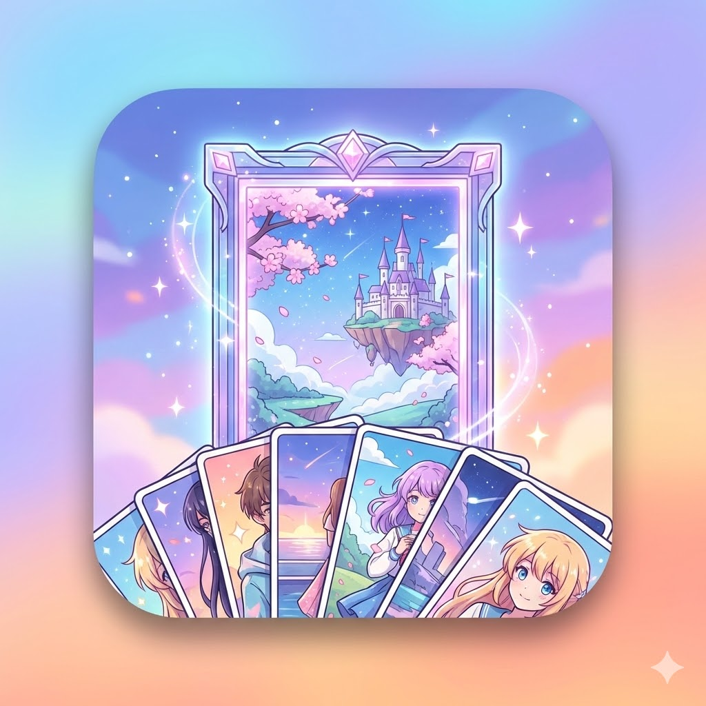
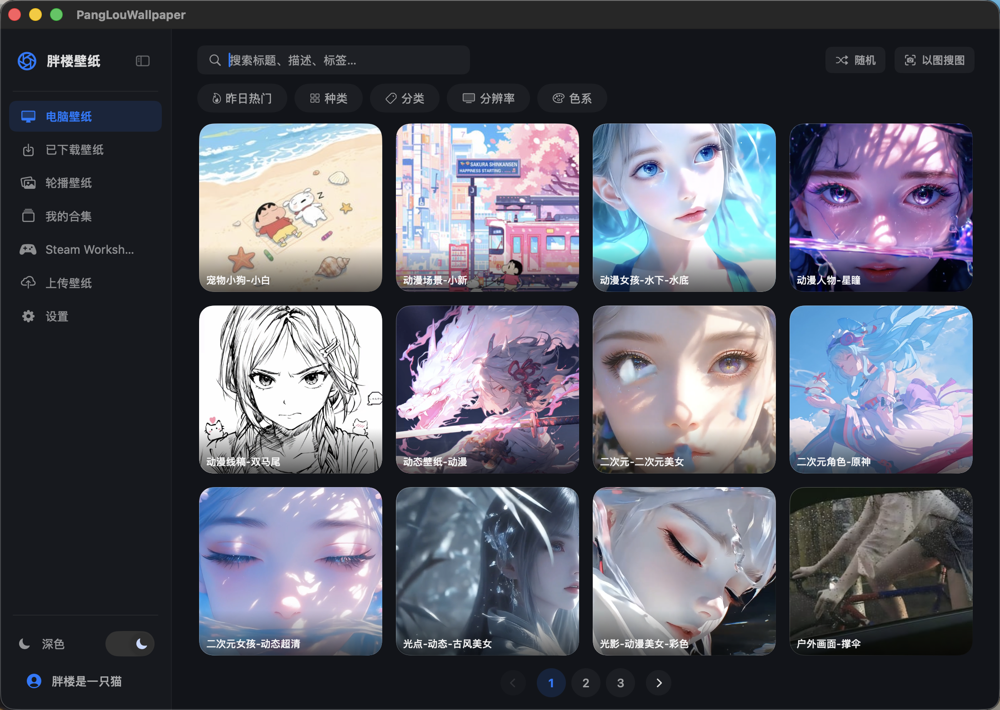
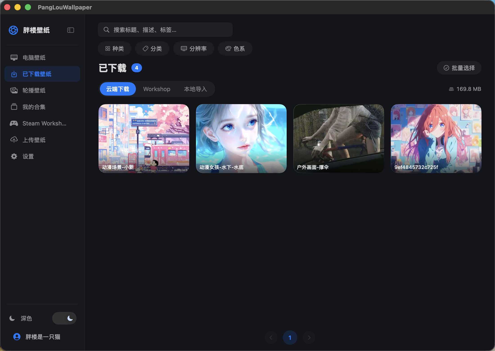
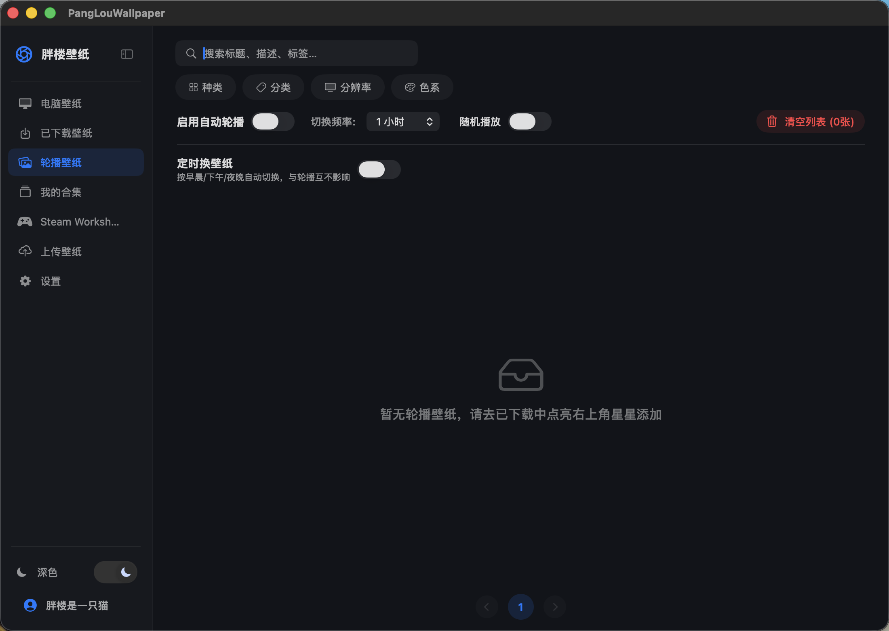
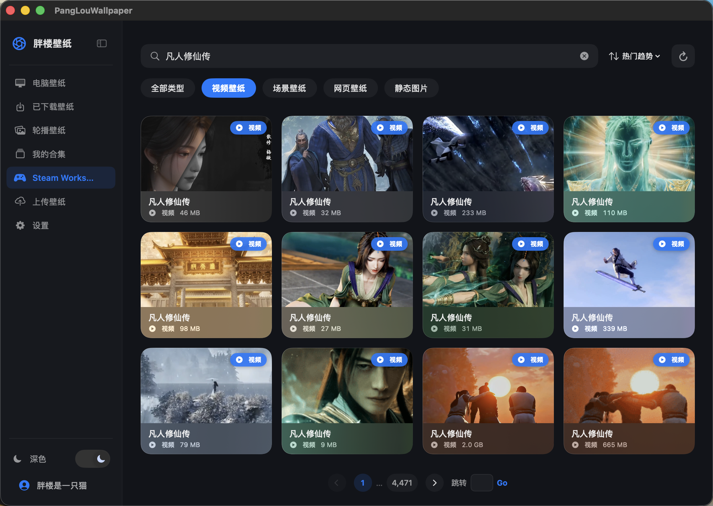

# 胖楼壁纸

**一款专为 macOS 打造的高颜值壁纸管理应用**

---

## 截图预览

| 电脑壁纸 | 已下载管理 |
|:---:|:---:|
|  |  |

| 轮播壁纸 | Steam Workshop |
|:---:|:---:|
|  |  |

---

## 功能介绍

### 🖼 海量壁纸云端库
- 精选静态壁纸与动态（视频）壁纸，按**分类、分辨率、色系**多维筛选
- 支持关键词搜索标题、描述、标签
- **以图搜图** — 拖入或选择参考图，自动检索风格相似的壁纸

### 🎬 动态壁纸
- 支持 MP4 / MOV 视频壁纸直接设为桌面背景，无缝循环播放，无黑屏
- 独立音量控制，支持静音
- **节能模式**：检测到桌面被窗口覆盖时自动暂停播放，省电省 GPU

### 📥 本地管理
- 一键下载云端壁纸到本地，缓存管理清晰直观
- 支持**导入本地图片 / 视频**直接作为壁纸使用
- **批量操作**：多选删除、批量加入合集

### 🔄 轮播播放
- 自定义轮播壁纸列表，按设定间隔自动切换
- 支持顺序 / 随机两种播放模式

### 📁 合集管理
- 创建多个合集，分类收藏你喜欢的壁纸
- 支持重命名、删除合集，跨合集移动壁纸

### 🎮 Steam Workshop 集成
- 直接浏览并使用 Wallpaper Engine 的 Steam Workshop 壁纸
- 自动识别本机已安装的 Workshop 内容

### 🌐 网页壁纸
- 支持将本地 HTML 动态页面设为桌面壁纸

### 📤 社区上传
- 登录后可将自制壁纸上传到公共库
- 上传内容经审核通过后，在「电脑壁纸」界面对所有用户可见

### 🖥 多屏支持
- 可独立指定将壁纸应用到某台显示器，或全部屏幕同步

### 🌗 深色 / 浅色主题
- 完整适配深色与浅色模式，一键切换

---

## 系统要求

- macOS 13 Ventura 及以上
- Apple Silicon / Intel 均支持

---

  Made with ❤️ for macOS

